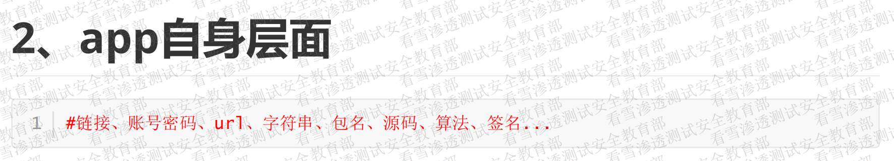

# 域名信息收集

## 子域名信息收集

**1、工具篇：**

在线工具：1、https://dnsdumpster.com/

​					2、https://securitytrails.com/

​					3、https://x.threatbook.cn/

​					4、https://www.yunsee.cn/

​					5、https://viewdns.info

开源工具：1、oneforall

​					2、DBJ

​					3、灯塔

​					4、goby

**2、手工**

hacking语法   、  site：“baidu.com”

## 相似站信息收集

baidu.com

baidu.cn

baidu123.cn

## whois信息收集

https://whois.chinaz.com/

**1、常规信息收集**

注册邮箱：1、谁注册的

​					2、邮箱反查：注册了哪些域名和网站、注册时间和过期时间、注册的DNS、注册者

注册人：注册人反查

注册电话：电话反查

注册商：小厂商可以社工

历史查询：以前使用的手机号、邮箱号、网站创建时间

**2、非常规信息收集/社工钓鱼**

手机号、邮箱号、注册人（进行二级资产信息收集）

# WAF（防火墙）识别信息收集

## 手工：看图识别WAF

https://blog.csdn.net/tomyyyyyy/article/details/119963179

## 工具：wafwoof

# 真实IP信息收集/绕过CDN

**CDN简介**

## 识别CDN

https://ping.chinaz.com/ 

https://www.boce.com/ping/

## 1、CDN架设原理绕过类

### 1.1、子域名寻找真实IP/域名本身

>寻找真实IP的作用：
>
>扩大攻击范围，寻找更多的暴露面，做更多的尝试

### 1.2、 历史DNS解析记录寻找真实IP

> 注意：任何一种方法都可以有助于我们，收集到真实IP
>
> 但需要多维度、多条件的判定和比对，才能确认真实IP

可能出现的情况：

经过时间变更，域名可能发生变化，通过DNS历史解析，可回溯找到历史的真实IP

### 1.3、国外ping获取真实IP

### 1.4、暗黑谷歌系列寻找真实IP

## 2、漏洞类绕过CDN（思想）

> 本质：借助漏洞来获取真实IP
>
> 实际操作：通过攻击手法和漏洞能够获取相关源码以及配置文件的特点，来获取真实IP

## 3、常规类

## 3.1邮件服务-寻找真实IP

## 3.2、利用SSL证书寻找真实IP

## 3.3、配置不当

## 3.4、F5 LTM解码法

## 3.5、全网扫描（不考虑，对配置有要求）

## 3.6、APP反编译/JS信息收集

## 4、判断技巧

## 5、排查顺序

## 6、深度利用

# 端口服务信息收集

真实IP与域名、以及端口间的关系

## 在线端口扫描

http://coolaf.com/tool/port

## 扫描工具

1、masscan

2、goby

3、nmap

## 暗黑谷歌

# 敏感信息收集

1、源码泄露

2、敏感路径

3、真实路径

# 操作系统版本收集

大小写探测路径法

原理：Windows对大小写部敏感，Linux对大小写敏感

（修改访问路径中字母的大小写，看看是否可以正常访问）

# 脚本开发语言信息收集

# 中间件信息收集

# 数据库信息收集

# CMS信息收集

**1、工具篇**

https://www.yunsee.cn/

https://x.threatbook.cn/

**2、手工篇**

脚注观察、路径搜索、F12

**3、脚本篇**

EHole2.0：https://github.com/EdgeSecurityTeam/EHole

Finger：https://github.com/EASY233/Finger

Glass：https://github.com/s7ckTeam/Glass

# 关于目标B段和C段的信息收集

在进行真实IP以及域名收集时，可观察它们的IP地址，若发现连续，可能是购买了B段或C段的一段来作为公司的资产，可使用工具扫描一下

# 模拟正常用户-站点使用信息收集

# APP信息收集

# 工具综合信息收集

# 社工分析

# 公司层面的信息收集

# 漏洞情报管理

